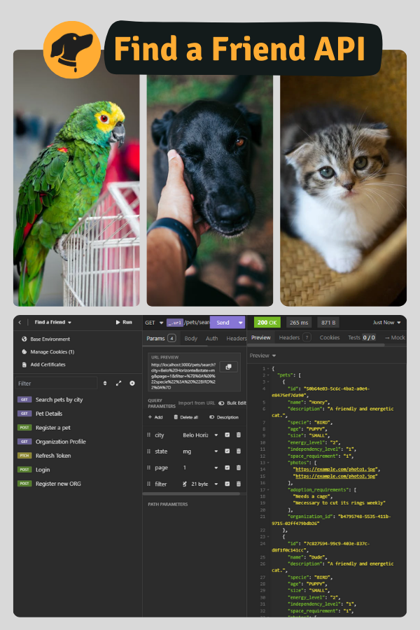

# Find a Friend - API with SOLID concepts



## Summary

- [Dependencies](#dependencies)
- [Dev Dependencies](#dev-dependencies)
- [Objectives](#objectives)
- [Routes](#routes)
- [How to execute the project](#how-to-execute-the-project)
- [Author](#author)

## Dependencies

- [Fastify](https://fastify.dev/): Fast and low overhead web framework, for Node.js.

- [fastify-type-provider-zod](https://github.com/turkerdev/fastify-type-provider-zod): Is designed to integrate Zod as a type provider in Fastify, enabling schema validation and type inference for requests and responses.

## Dev Dependencies

- [ESLint](https://eslint.org/): Code analysis tool responsible for identifying errors and inconsistencies.

- [Prettier](https://prettier.io/): Code formatting tool that ensures code style consistency.

- [Typescript](https://www.typescriptlang.org/): A strong typed programming language that builds on JavaScript

- [Tsx](https://www.npmjs.com/package/tsx): TypeScript Execute (tsx) is the easiest way to run TypeScript in Node.js, because Node.js was created with JavaScript.

- [Vitest](https://vitest.dev/): A fast testing framework, specially for Vite projects, offering Jest-like functionality with built-in TypeScript support, optimized for speed and modern development.

- [npm-run-all](https://www.npmjs.com/package/npm-run-all): The official npm run-script command cannot run multiple scripts, so if we want to run multiple scripts, it's redundant a bit. The npm-run all short it by glob-like patterns.

- [supertest](https://www.npmjs.com/package/supertest): It provides a high-level abstraction for testing HTTP while also allowing you to access the lower-level API provided by the superagent. In other words, testing the server without having to run it on a specific port, avoiding conflicts.

## Objectives

This project aims to facilitate pet adoption by allowing organizations (ORGs) to register available animals and users to search for pets in their cities. ORGs can manage their profiles and list pets with specific characteristics, while users can view animal details and contact the ORGs directly via WhatsApp to start the adoption process.

- Application Rules:

  - [x] It should be able to register a pet
  - [x] It should be able to list all able pets to be adopted in a city
  - [x] It should be able to filter pets by its characteristics
  - [x] It should be able to visualize a pet details to the adoption
  - [x] It should be able to register yourself as an ORG (Organization)
  - [x] It should be able to login/be authenticated as an ORG

- Business Rules:
  - [x] To list the pets, is required to inform the city
  - [x] It's required to an ORG to have an address and a WhatsApp number
  - [x] A pet must be linked to an ORG
  - [x] The user that want to adopt will contact the ORG by WhatsApp
  - [x] All the filters, except the city, are optionals
  - [x] For an ORG to access the application as an Admin, it must be logged.

## Routes

### Organization

- Register a new ORG: `/organization`

  - Method: `POST`
  - Body:
    - Organization Name: string
    - Owner: string
    - Email: string
    - Address: string
    - CEP: number
    - WhatsApp: number (11 characters)
    - Password: string (Between 6 to 15 characters)
    - Confirm Password: string (Between 6 to 15 characters)
  - Status Code: `201`

---

- Login/Authentication: `/login`

  - Method: `POST`
  - Body:
    - Email: string,
    - Password: string (Between 6 to 15 characters)
  - Status Code: `200`
  - Data Returned:

```typescript
interface IAuthentication {
  token: string;
}
```

---

- Refresh Token: `/token/refresh`

  - Method: `PATCH`
  - Status Code: `200`

---

- Organization Profile: `/organization/profile`

  - **Safe route:** Authentication required
  - Method: `GET`
  - Status Code: `200`
  - Data Returned:

```typescript
interface IOrganizationProfile {
  id: string;
  created_at: string;
  email: string;
  cep: string;
  owner: string;
  organizationName: string;
  address: string;
  whatsApp: number;
}
```

---

### Pet

- Register a new pet: `/pet`

  - **Safe route:** Authentication required
  - Method: `POST`
  - Body:
    - Name: string
    - Description: string (optional)
    - Specie: Cat | Dog | Bird | Other
    - Age: Puppy | Adult | Senior
    - Size: Small | Medium | Large
    - Energy Level: number (between 1 and 5)
    - Independency Level: number (between 1 and 3)
    - Space Requirements: number (between 1 and 3)
    - Photos: string []
    - Adoption Requirements: string []
    - Organization Id: string
  - Status Code: `201`

---

- Pet Details: `/pet/:petId`
  - Method: `GET`
  - Status Code: `200`
  - Data Returned:

```typescript
interface IPetProfile {
  id: string;
  name: string;
  description?: string;
  specie: "Cat" | "Dog" | "Bird" | "Other";
  age: "Puppy" | "Adult" | "Elderly";
  size: "Small" | "Medium" | "Large";
  energyLevel: number; // between 1 and 5
  independencyLevel: number; // between 1 and 3
  spaceRequirements: number; // between 1 and 3
  photos: string[];
  adoptionRequirements: string[];
  organizationId: string;
}
```

---

- Search Pets by City: `/pet/:organizationId`

  - Method: `GET`
  - Query:
    - City: string
    - State: string
    - Page: (max 20 pets per page)
    - Filter?: Age | Specie | Energy Level | Independency Level | Space Requirements
  - Status Code: `200`
  - Data Returned:

```typescript
interface IPets {
  pets: {
    id: string;
    name: string;
    specie: "Cat" | "Dog" | "Bird" | "Other";
    photo: string;
  }[];
}
```

---

- Remove a Pet: `/pet`

  - Method: `DELETE`
  - Params:
    - Pet Id: string
  - Status Code: `204`

---

## How to execute the project

1. **Clone the repository**: Run the following command to clone the project into your machine:

```bash
git clone https://github.com/SantiagoMorais/find-a-pet
```

2. **Install dependencies**: Navigate to the root project folder and install the necessary dependencies:

```bash
npm install
```

3. **Initialize the Docker container**: Run Docker Compose to start the container in detached mode:

```bash
docker compose up -d
```

4. **Start the container (if necessary)**:
   - When you first create the container using Docker Compose, it starts automatically.
   - To start the container manually in the future:

I. List all created containers:

```bash
docker ps -a
```

II. Find the container named **find-a-friend-api-find-a-friend-pg-1**

III. Copy the container ID and run the following command (replacing `<container_id>`):

```bash
docker start <container_id>
```

IV. Verify that the container is running:

```bash
docker ps
```

5. **Configure environment variables**: Create a `.env` file in the project root based on the `.env.example` file provided.

6. **Run database migrations**: Execute the following command to apply Prisma migrations:

```bash
npx prisma migrate dev
```

7. **Start the development server**: Launch the server in development mode:

```bash
npm run server:dev
```

8. **Run tests**: Verify that everything is working correctly by running the tests:

Unit tests:

```bash
npm run test:unit
```

Or run in watch mode:

```bash
npm run test:unit:watch
```

End-to-End (E2E) tests:

```bash
npm run test:e2e:watch
```

Or run in watch mode:

```bash
npm run test:e2e:watch
```

If everything is working well, it's ready to be used! 🚀

## Author

- GitHub - [Felipe Santiago Morais](https://github.com/SantiagoMorais)
- Linkedin - [Felipe Santiago](https://www.linkedin.com/in/felipe-santiago-873025288/)
- Instagram - [@felipe.santiago.morais](https://www.instagram.com/felipe.santiago.morais)
- Email - <a href="mailto:contatofelipesantiago@gmail.com" target="blank">contatofelipesantiago@gmail.com</a>
- <a href="https://api.whatsapp.com/send?phone=5531996951033&text=Hi%2C%20Felipe%21%20I%20got%20your%20contact%20from%20your%20github.">Whatsapp</a>
